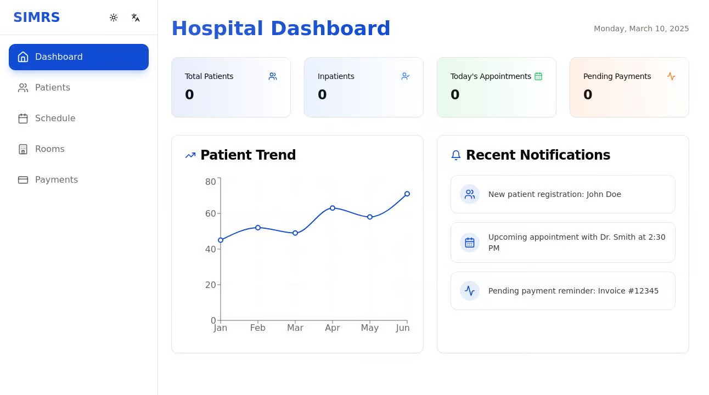

# SIMRS (Sistem Informasi Manajemen Rumah Sakit)

A comprehensive hospital management system built with modern web technologies. SIMRS helps hospitals digitize and streamline their operations, from patient management to billing.



## Features

### 📊 Dashboard
- Real-time hospital statistics
- Patient trends visualization
- Important notifications
- Payment status overview

### 👥 Patient Management
- Patient registration and profiles
- Medical history tracking
- Appointment scheduling
- Digital records management

### 📅 Scheduling System
- Appointment management
- Doctor schedules
- Room allocation
- Calendar view

### 🏥 Room Management
- Real-time room status
- Patient assignment
- Room type categorization
- Occupancy tracking

### 💰 Financial Management
- Payment processing
- Invoice generation
- Payment status tracking
- Financial reporting

### 🌐 Multilingual Support
- English (en)
- Indonesian (id)
- Easy language switching

### 🎨 Theme Customization
- Light mode
- Dark mode
- System preference support

## Tech Stack

- **Frontend**: React, TypeScript, TailwindCSS, Shadcn/UI
- **Backend**: Express.js
- **Database**: In-memory storage (ready for PostgreSQL integration)
- **State Management**: TanStack Query
- **Charts**: Recharts
- **Form Handling**: React Hook Form, Zod
- **Routing**: Wouter

## Getting Started

### Prerequisites

- Node.js 20 or higher
- npm (comes with Node.js)

### Installation

1. Clone the repository
```bash
git clone https://github.com/yourusername/simrs.git
cd simrs
```

2. Install dependencies
```bash
npm install
```

3. Start the development server
```bash
npm run dev
```

The application will be available at `http://localhost:5000`

## Project Structure

```
simrs/
├── client/
│   ├── src/
│   │   ├── components/     # Reusable UI components
│   │   ├── hooks/         # Custom React hooks
│   │   ├── lib/           # Utilities and configurations
│   │   └── pages/         # Application pages
├── server/
│   ├── routes.ts          # API routes
│   └── storage.ts         # Data storage interface
├── shared/
│   └── schema.ts          # Shared types and schemas
└── theme.json             # Theme configuration
```

## Available Scripts

- `npm run dev` - Start the development server
- `npm run build` - Build the production version
- `npm run start` - Start the production server

## Contributing

1. Fork the repository
2. Create your feature branch (`git checkout -b feature/AmazingFeature`)
3. Commit your changes (`git commit -m 'Add some AmazingFeature'`)
4. Push to the branch (`git push origin feature/AmazingFeature`)
5. Open a Pull Request

## Future Roadmap

- [ ] BPJS Integration
- [ ] SatuSehat Integration
- [ ] Laboratory Management
- [ ] Pharmacy Integration
- [ ] Advanced Reporting
- [ ] Medical Records Integration

## License

This project is licensed under the MIT License - see the [LICENSE](LICENSE) file for details.

## Acknowledgments

- [Shadcn/UI](https://ui.shadcn.com/) for the beautiful UI components
- [TanStack Query](https://tanstack.com/query/latest) for data fetching
- [Recharts](https://recharts.org/) for charts and visualizations
